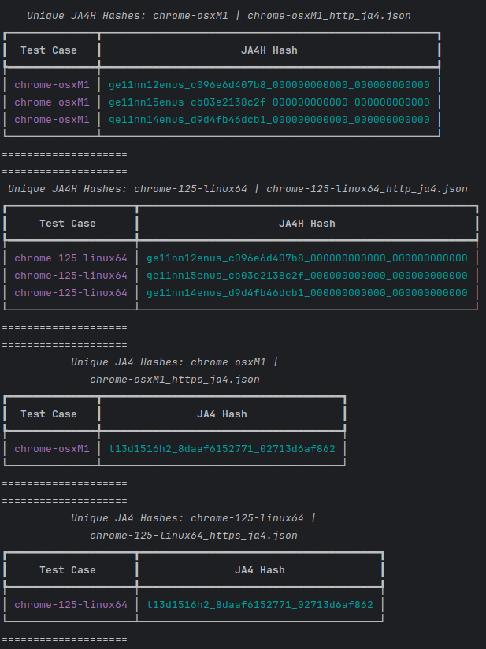

# Setup

All that is needed for setup for local testing should be adding your local IPv4 to map to `www.example.com` via `/etc/hosts`.
For example: 

```
cat /etc/hosts
192.168.1.4     www.example.com
```

This is to use the default values passed in via `cmds/start.sh`. 

Then build all the necessary files and install dependencies:

```
pip install -r requirements.txt
docker build -f ja4.dockerfile -t ja4-analysis .
docker build -f ja3.dockerfile -t ja3-analysis .
docker build -f https-logserver.dockerfile -t https-logserver . 
```


# Usage

Run `specter` against a directory that contains the unencrypted and encrypted pcaps from the `https-logserver` to extract JA3 and JA4+ fingerprints from the captures. 
It will save to `{pcap_name}_ja3.json` and `{pcap_name}_http_ja4.json` as well as `{pcap_name}_https_ja4.json`.

`python specter.py --capture-dir ./captures/nuclei`



# Automated capturing

`specter` will attempt to run any `.dockerfile`s that are in the `docker_files` directory. There is a naming scheme: 

`{category}_{meta}_{tool_name}.dockerfile`

- `category`: Used for tracking what kind of tool or attack type this is relevant to. Such as `poc`, `xss`, etc.
- `meta`: This is case sensitive, used for tracking what kind of traffic the tool generates. If it is capitalized it indicates a positive for:
  - `B`: Indicates this generates bot / booter traffic.
  - `W`: Indicates this generates legitimate browser traffic, usually because of browser automation, such as `chromedriver`.
  - `O`: Indicates this generates traffic from a command line tool.
  - `S`: Indicates this generates traffic from a scanning or fuzzing.


It will spin up the container and pass in the following ENV variables: 

- `CMDLINE_EXEC`: The full command needed to execute the tool. This is mandatory and must be supplied in the dockerfile. See `disabled_dockerfiles` examples.
- `TARGET_URL`: The URL to send traffic to. Default: `https://www.example.com/?a=FUZZ`
- `TARGET_HOST`: The host to send traffic to. Default: `www.example.com`
- `TARGET_PORT`: The port to send traffic to. Default: `8443`
- `INJECTION_POINT`: Used for tools like sqlmap where you can specify a parameter to inject into. Default: `a`
- `POST_DATA`: Used for tools like sqlmap using `--data` to send POST requests. Default: `a=FUZZ`
- `TARGET_SCAN`: Used for tools that specify different scan configurations, such as `nuclei -t {template}`. Default: `cves`
- `FILE_UPLOAD`: Used for tools that specify a webshell upload or similar. Default: `None`
- `FIlE_INCLUDE`: Used for tools that specify a remote file to include. Default: `None`
- `REMOTE_COMMAND`: Used for tools that specify a command to run against a remote host. Default: `None`

### Post Processing

After `specter` has run a container, it will download the logs out of the capture server, creating several files:

- `{tool_name}_http.pcap`: This contains the unencrypted traffic capture from the capture server.
- `{tool_name}_https.pcap`: This contains the encrypted traffic capture from the capture server.
- `{tool_name}_access.log`: This contains the nginx `access.log` from the capture server.
- `{tool_name}_access.log.payloads`: This contains the fully url-decoded and weird/rarer UTF decoded payloads - wrapped in base64. Each is base64 encoded in order to preserve chars such as `%0a%0d` or newline chars.
- `{tool_name}_ja.json`: Extracted JA3 data from the `https.pcap` file.
- `{tool_name}_http_ja4.json`: Extracted JA4+ data (typically JA4H) from the `http.pcap` file.
- `{tool_name}_https_ja4.json`: Extracted JA4+ data (typically JA4) from the `https.pcap` file.

# Manual capturing

A lot of tools can't be easily containerized, particularly if they are using browser automation without `headless` mode.
In that case, we can manually pull packet captures. Spin up a new instance of the `https-logserver`:

`docker run -dti --name https-logserver -p 8443:443 https-logserver`

Then fuzz your tool against `https://www.example.com:8443`. When finished, download the packet captures:

- `/root/eth0_capture.pcap`: Will contain any packet captures that hit the external interface. These will be encrypted.
- `/root/lo_capture.pcap`: Will contain any packet captures that get forwarded from Nginx to the `honeypot.py` sanic backend. These will be unencrypted.
- `/var/log/nginx/access.log`: Will contain a JSON lines file that contains a lot of useful information such as headers (preserves header order), JA3 hash information, as well as the full request URI, which can be used to extract the individual payloads generated by the tool.

To automate this process, you can use `manual-specter.py`

```
usage: manual-specter.py [-h] [--output-dir OUT_DIR] --capture-name CAP_NAME

options:
  -h, --help            show this help message and exit
  --output-dir OUT_DIR  Output pcaps and access log to this directory.
  --capture-name CAP_NAME
                        Naming scheme for captures.

```

Once you are done sending traffic to the capture server, hit enter and it will download the log files to the `--output-dir` and analyze them for JA3 and JA4+ hashes.


# Nuclei Fuzzer

The included `nuclei_fuzzer.py` script can be used to generate packet captures of every single CVE that nuclei has, split into individual packet captures. All captures are saved to the `captures/nuclei-cves` directory.

Use it with `python3 nuclei_fuzzer.py -u https://www.example.com:8443/`. Useful for probing WAFs to see what CVEs they do or do not block.

